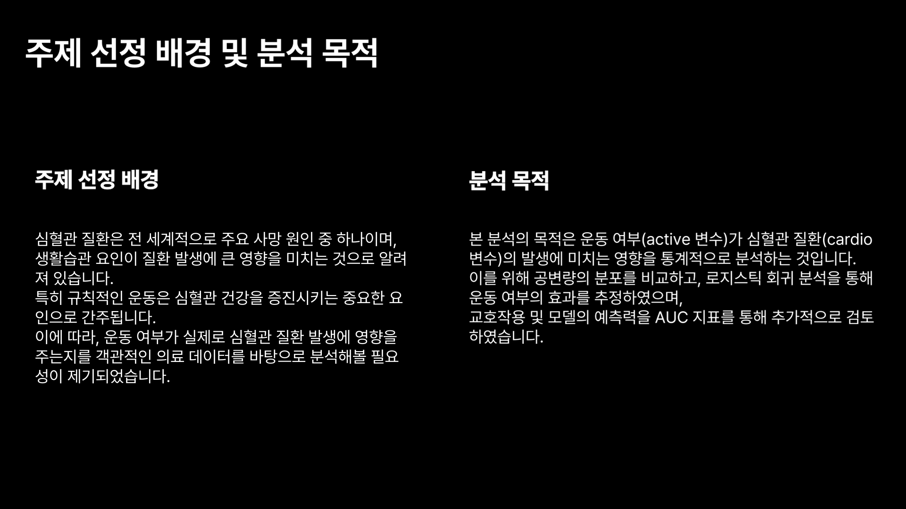
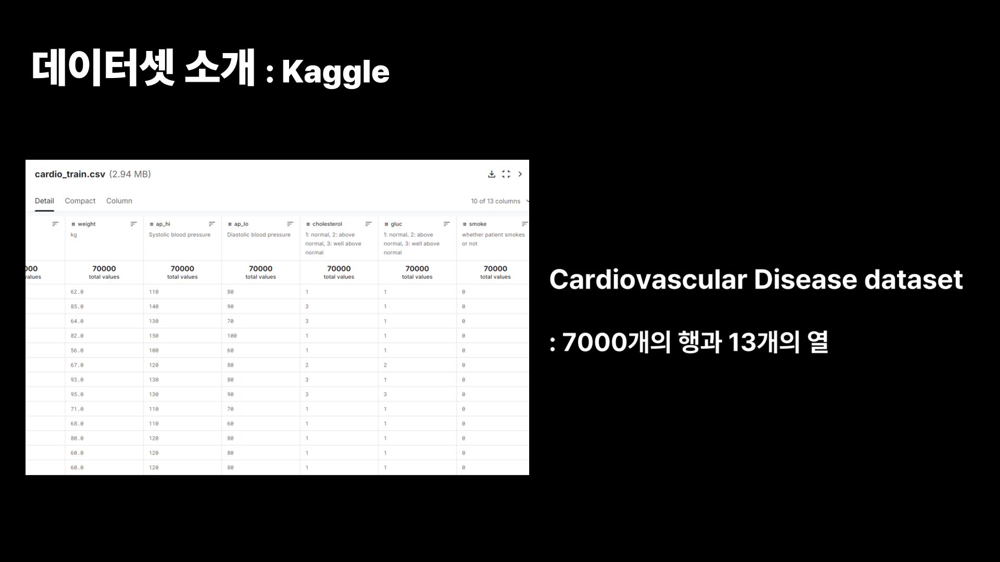
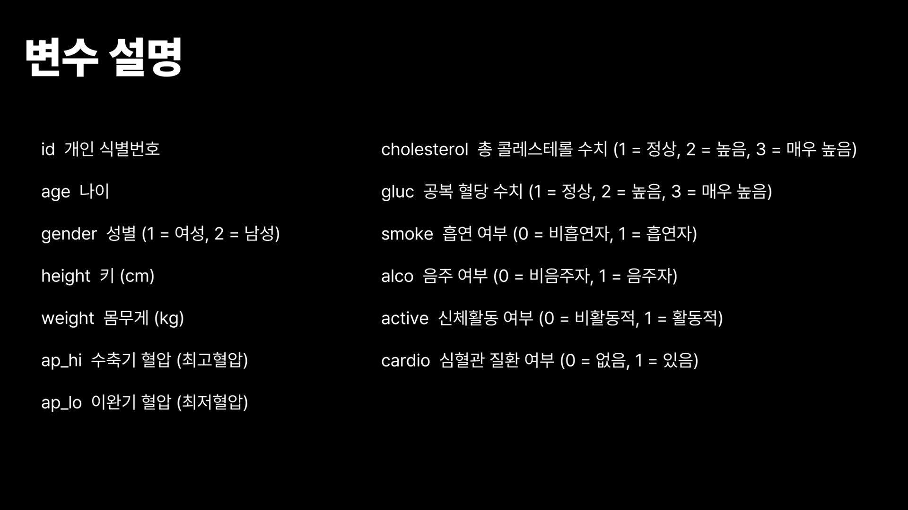
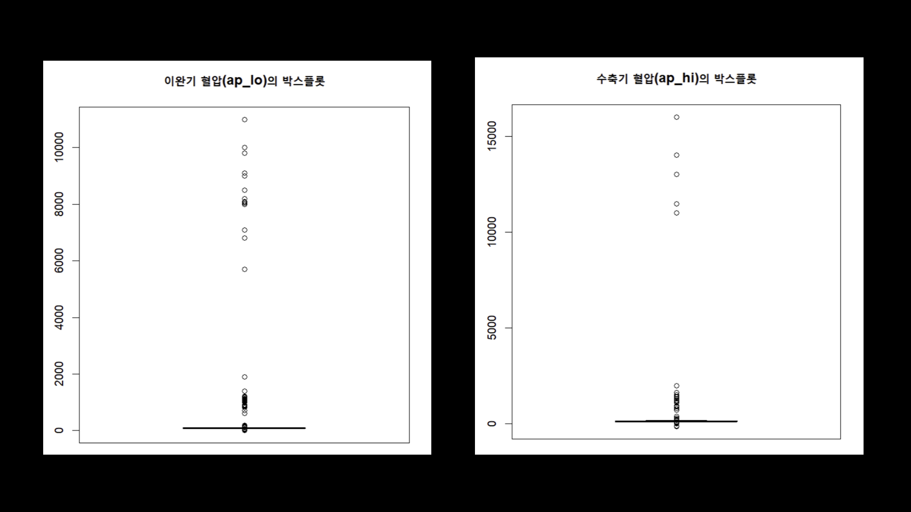
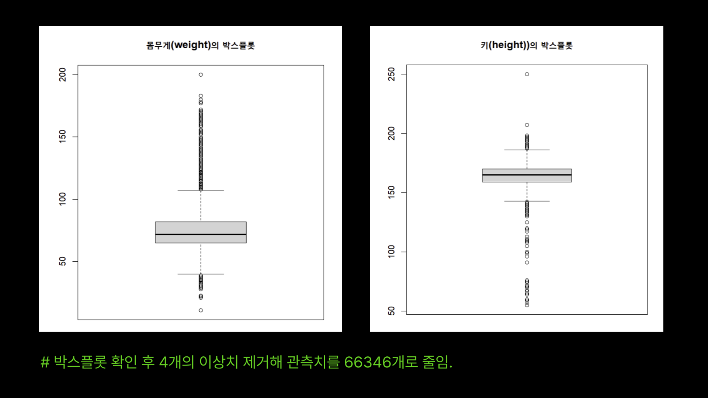
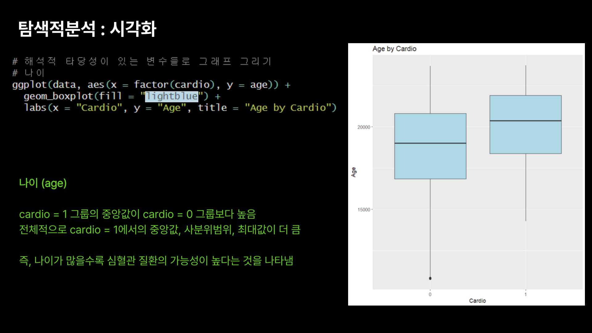
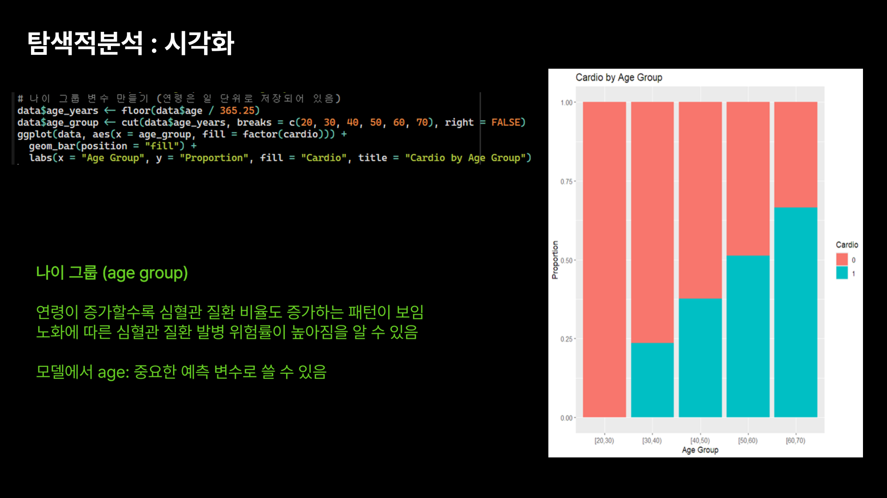

# 운동 여부가 심혈관 질환에 미치는 영향 분석

## 📊 프로젝트 개요
kaggle의 Cardiovascular Disease 데이터셋을 활용하여, 운동 여부가 심혈관 질환 발생에 미치는 영향을 통계적으로 분석 및 로지스틱 회귀 모델의 예측력 검토 및 변수들 간 상관관계 분석.

데이터셋: Cardiovascular Disease dataset  
출처: https://www.kaggle.com/datasets/sulianova/cardiovascular-disease-dataset

---

## 📈 주요 결론 요약

* **오즈비 해석:** 운동을 하는 그룹이 그렇지 않은 그룹에 비해 심혈관 질환 발생의 오즈비가 O.79배임을 통계적으로 확인 (p<0.05)

* **교호작용 분석:** 운동의 여부가 나이와 혈압, 콜레스테롤과의 교호작용이 있음을 확인

* **최종 모델 선택:** 교호작용을 포함한 모델과 포함하지 않은 모델 비교 결과 해석의 복잡도 대비 성능 향상이 크지 않았으므로 교호작용 미포함 모델을 최종 선택 (AUC: 0.7915)

---

## 🖼️ 프로젝트 발표 슬라이드

   
   
   

